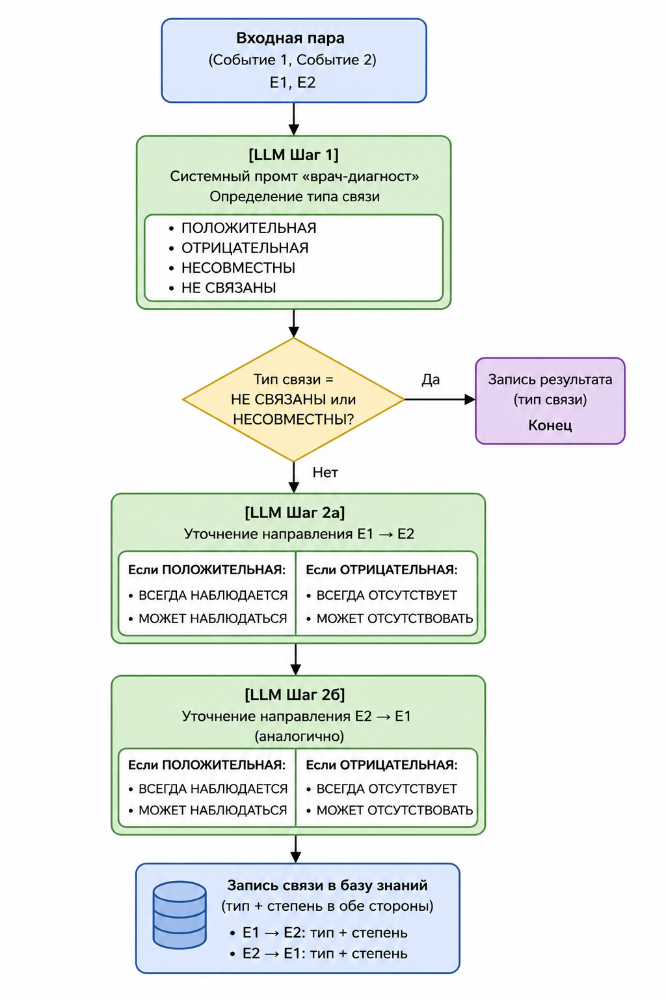
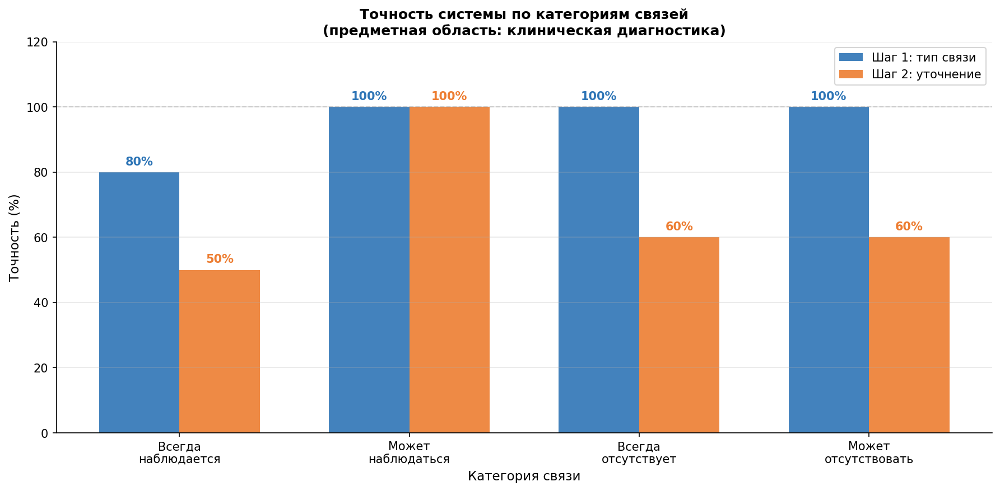
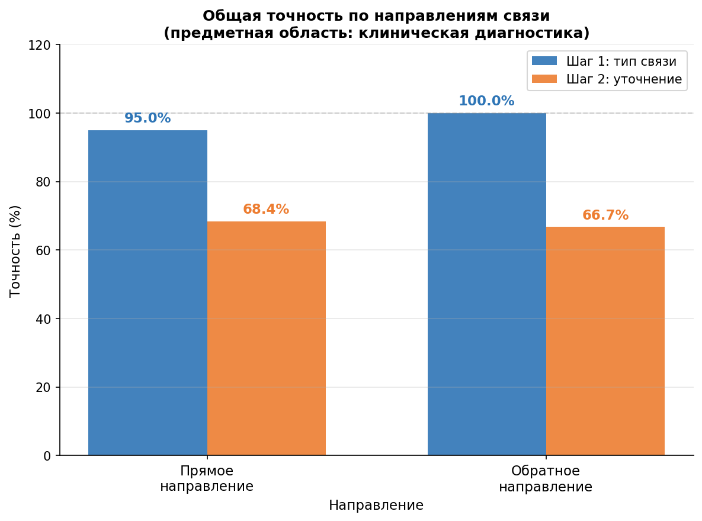

# Knowledge Base LLM — Автоматизация постановки связей в базе знаний

Прототип системы автоматической расстановки связей между событиями в базе знаний с использованием больших языковых моделей (LLM). Предметная область — клиническая диагностика заболеваний лёгких.

## О проекте

При формировании базы знаний эксперт вручную устанавливает связи между парами событий — симптомов, диагнозов, лабораторных показателей. Этот процесс трудоёмок и требует много времени специалиста. Данный проект автоматизирует его с помощью LLM через prompt engineering, без дообучения модели.

Для каждой пары событий система определяет:

**Шаг 1 — тип связи:**
- ПОЛОЖИТЕЛЬНАЯ — событие 1 может наблюдаться при наличии события 2
- ОТРИЦАТЕЛЬНАЯ — событие 1 уменьшает возможность события 2
- НЕСОВМЕСТНЫ — события не могут наблюдаться одновременно
- НЕ СВЯЗАНЫ

**Шаг 2 — степень связи:**
- Для положительной: ВСЕГДА НАБЛЮДАЕТСЯ / МОЖЕТ НАБЛЮДАТЬСЯ
- Для отрицательной: ВСЕГДА ОТСУТСТВУЕТ / МОЖЕТ ОТСУТСТВОВАТЬ

Процедура выполняется в обоих направлениях, так как связь может быть асимметричной.

## Структура проекта

```
knowledge-base-llm/
├── src/
│   ├── gpt_conn_xlsx.py   # основной пайплайн — тестирование на датасете
│   └── analysis.py        # построение графиков по результатам
├── datasets/
│   └── *.xlsx             # датасет с размеченными парами событий (2179 пар)
├── results/
│   ├── results_*.json     # результаты запусков
│   ├── graph1_by_category.png
│   └── graph2_directions.png
├── docs/
│   └── pipeline.png       # схема пайплайна
└── requirements.txt
```
## Установка

```bash
pip install -r requirements.txt
```

## Запуск

**Тестирование на датасете:**
```bash
python src/gpt_conn_xlsx.py
```

Перед запуском укажи в файле свой API-ключ и путь к датасету:
```python
XLSX_PATH = "datasets/your_dataset.xlsx"
API_KEY = "your_api_key"
```

Результаты автоматически сохраняются в JSON-файл с временной меткой в папке `results/`.

**Построение графиков:**
```bash
python src/analysis.py
```

## Архитектура pipeline

В проекте используется готовая языковая модель через API без локальной загрузки весов, поэтому инструменты визуализации нейронных сетей (torchinfo, Netron) неприменимы. Вместо этого архитектура описана через схему потока данных:



Для каждой пары событий выполняется три последовательных обращения к LLM:

1. Шаг 1 — определение типа связи (SYSTEM_TYPE промт)
2. Шаг 2а — уточнение в прямом направлении E1→E2 (SYSTEM_REFINE_POS или SYSTEM_REFINE_NEG)
3. Шаг 2б — уточнение в обратном направлении E2→E1

## Формат датасета

| Столбец | Описание |
|---|---|
| Событие 1 | Первое клиническое наблюдение |
| Событие 2 | Второе клиническое наблюдение |
| Взаимосвязь | Метка: всегда наблюдается / может наблюдаться / всегда отсутствует / может отсутствовать |
| Обратная связь | Метка для обратного направления (может быть пустой) |

## Результаты

| Направление | Шаг | Точность |
|---|---|---|
| Прямое | Шаг 1 (тип связи) | 95.0% |
| Прямое | Шаг 2 (уточнение) | 68.4% |
| Обратное | Шаг 1 (тип связи) | 100.0% |
| Обратное | Шаг 2 (уточнение) | 66.7% |




## Технический стек

- Python 3
- GPT-4o-mini через OpenAI-совместимый API
- pandas — чтение датасета
- matplotlib — визуализация результатов
- Формат ответов: JSON с chain-of-thought рассуждением
- Temperature: 0.1 для воспроизводимости

## Автор

Тойчубекова Асель Нурлановна, РУДН, НПИбд-02-23
Научный руководитель: Молодченков Алексей Игоревич
